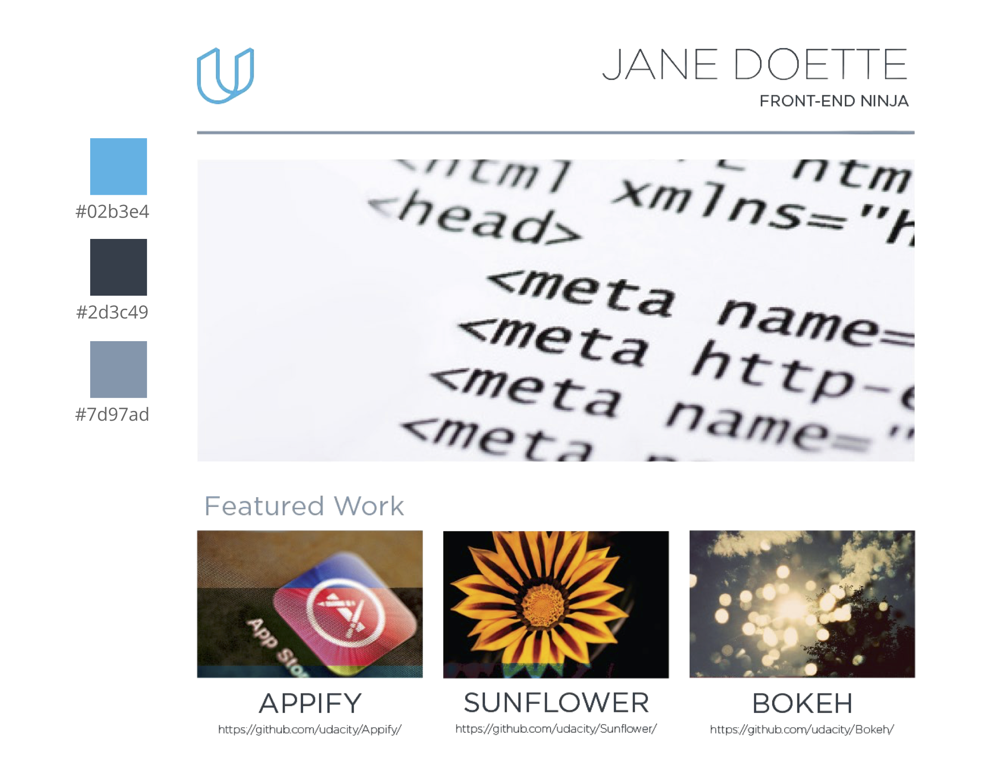

# Udacity-Portfolio
This portfolio is part of Udacity's [Front-End-Web Developer Nano Degree Course Project](https://www.udacity.com/course/front-end-web-developer-nanodegree--nd001).
# Check the Project:
 https://mmsoni22.github.io/Portfolioudacity/
# Goals
- [x] Replicate Design with HTML and CSS
- [x] Make the website responsive
# Mockup

